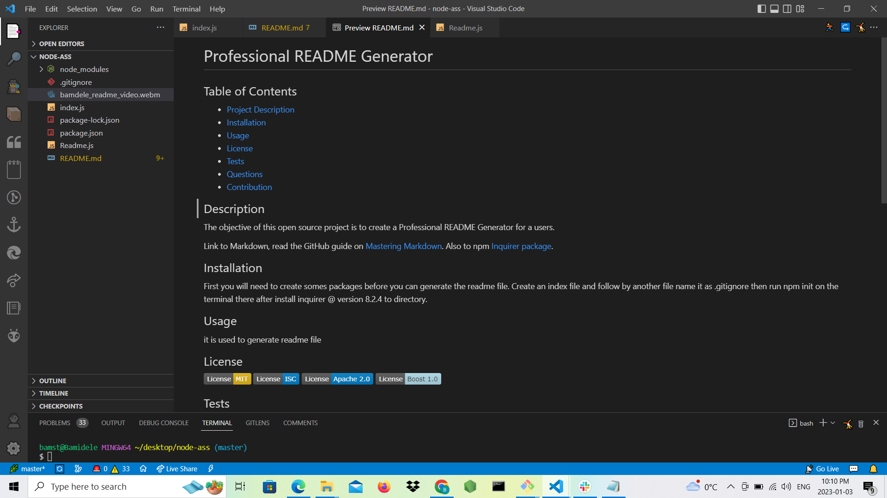
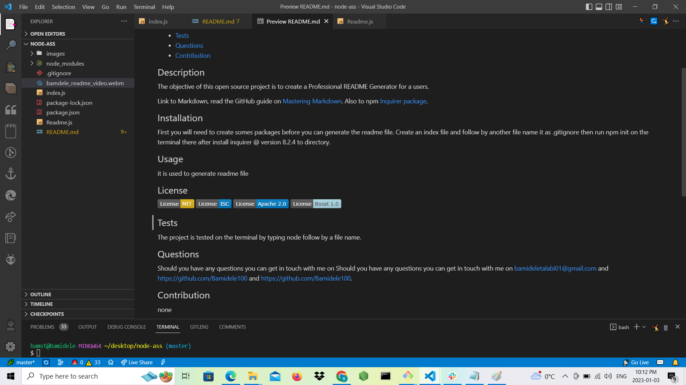

# Professional README Generator
    
## Table of Contents
- [Project Description](#Description)
- [Installation](#Installation)
- [Usage](#Usage)
- [License](#License)
- [Tests](#Tests)
- [Questions](#Questions)
- [Contribution](#Contribution)
    
## Description
The objective of this open source project is to create a Professional README Generator for a users.

Link to Markdown, read the GitHub guide on [Mastering Markdown](https://www.markdownguide.org/basic-syntax/). Also to npm [Inquirer package](https://www.npmjs.com/package/inquirer/v/8.2.4).

## Installation
 First you will need to create somes packages before you can generate the readme file. Create an index file and follow by another file name it as .gitignore then run npm init on the terminal there after install inquirer @ version 8.2.4 to directory. 
 
## Usage
it is used to generate readme file
    
## License

    
## Tests
The project is tested on the terminal by typing node follow by a file name.

## Questions
Should you have any questions you can get in touch with me on Should you have any questions you can get in touch with me on bamideletalabi01@gmail.com and https://github.com/Bamidele100. and https://github.com/Bamidele100.

## Contribution
none for now.

## Generated images

